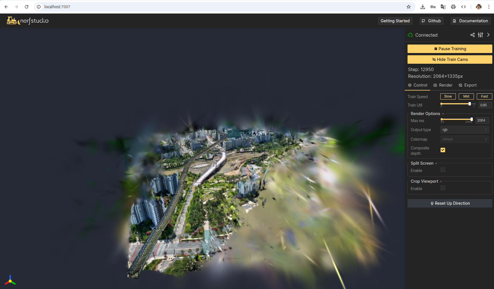

# HLOC-NeRFStudio: Advanced 3D Reconstruction with NeRFStudio

🚀 **Production-ready Docker container for NeRFStudio with HLOC, COLMAP, and RTX 5090 support**

This repository provides a comprehensive, pre-configured Docker environment that solves common compatibility issues and setup challenges when working with NeRFStudio, HLOC, COLMAP, and related 3D reconstruction tools. **Optimized for NVIDIA RTX 5090 with sm_120 architecture support.**

## ✨ Key Features

### 🎮 **RTX 5090 / Blackwell Architecture Support**
- ✅ **PyTorch 2.7.0 stable** with CUDA 12.8 runtime
- ✅ **sm_120 compute capability** for RTX 5090 support
- ✅ **gsplat 1.4.0** optimized for CUDA 12.8 compatibility
- ✅ **16GB shared memory** configuration for large scenes
- ✅ **31.3GB VRAM** fully supported and utilized

### 🔧 **Pre-solved Compatibility Issues**
- ✅ **COLMAP 3.12.4** with frames.bin support (C++ engine + nvcc compiler)
- ✅ **HLOC** with syntax fixes and PyColmap compatibility patches
- ✅ **NumPy 1.26.4** compatibility (fixes NeRFStudio v2.x issues)
- ✅ **PyMeshLab** conflicts resolved with Qt bypass patches
- ✅ **Viser CameraMessage** compatibility patches applied

### 🏗️ **Advanced Build System**
- 🐳 **Multi-stage Docker build** with intelligent caching
- 📦 **Pre-downloaded models** (SuperPoint, LightGlue, NetVLAD, etc.)
- 🔄 **Automated dependency management**
- 🛠️ **Smart fallback mechanisms** for robust builds

### 📚 **Comprehensive Tool Integration**
- **NeRFStudio**: Latest stable version with all extensions
- **HLOC**: Hierarchical localization with all feature extractors
- **COLMAP**: Structure-from-Motion and Multi-View Stereo
- **LightGlue**: State-of-the-art feature matching
- **SuperPoint/SuperGlue**: Deep feature extraction and matching

## 🚀 Quick Start

### Prerequisites
- Docker with NVIDIA Container Runtime
- **NVIDIA RTX 5090** (or other sm_120+ compatible GPU)
- **NVIDIA Driver 470+** with CUDA 12.8+ support
- Docker Compose

### 1. Clone and Setup
```bash
git clone https://github.com/yourusername/hloc-nerfstudio.git
cd hloc-nerfstudio
```

### 2. Build and Run
```bash
# Build the RTX 5090 optimized image
docker build -t hloc-nerfstudio:latest .

# Run with docker-compose (16GB shared memory)
docker-compose up -d

# Or run directly
docker run --rm --gpus all -v ./data:/workspace/data -v ./outputs:/workspace/outputs -p 7007:7007 -it hloc-nerfstudio:latest bash
```

### 3. Verify RTX 5090 Support
```bash
# Enter the container
docker-compose exec hloc-nerfstudio bash

# Check RTX 5090 detection
python -c "import torch; print('GPU:', torch.cuda.get_device_name(0)); print('Memory:', f'{torch.cuda.get_device_properties(0).total_memory / 1024**3:.1f} GB')"

# Test installation
ns-train nerfacto --help
python -c "import hloc; print('HLOC ready!')"
```

### 4. Complete Workflow Example

#### Step 1: Video Processing with HLOC
```bash
# Inside the container - process drone video with optimal settings
ns-process-data video \
    --data /workspace/data/daewoo_drone_003.mp4 \
    --output-dir /workspace/outputs/daewoo_drone_003_hloc \
    --feature-type superpoint \
    --matcher-type superpoint+lightglue \
    --num-downscales 3 \
    --camera-type perspective \
    --matching-method sequential \
    --verbose
```

#### Step 2: Gaussian Splatting Training
```bash
# Train with production-optimized parameters
ns-train splatfacto \
    --data /workspace/outputs/daewoo_drone_003_hloc \
    --viewer.websocket-port 7007 \
    --output-dir /workspace/outputs/splatfacto_daewoo_drone_003 \
    --viewer.quit-on-train-completion True \
    --vis viewer+tensorboard \
    --logging.steps-per-log 100 \
    --pipeline.model.cull-alpha-thresh 0.005 \
    --pipeline.model.densify-grad-thresh 0.0008 \
    --max-num-iterations 30000
```


*Real-time training progress showing RTX 5090 performance with ~18-19ms per iteration*

#### Step 3: Real-time 3D Viewer
Access the interactive viewer at: **http://localhost:7007**


*Interactive 3D viewer showing reconstructed drone scene with real-time rendering*

## 📂 Project Structure

```
hloc-nerfstudio/
├── Dockerfile              # Production-ready multi-stage build
├── docker-compose.yml      # Container orchestration
├── setup.sh               # One-click setup script
├── download_models.sh     # Pre-trained model downloader
├── scripts/               # Build and setup scripts
│   ├── upgrade-colmap.sh  # COLMAP C++ engine installer
│   ├── setup-dependencies.sh
│   └── verify-models.py
├── patches/               # Compatibility patches
│   ├── fix_hloc_syntax.py
│   ├── pymeshlab_bypass.py
│   └── fix_viser_camera_message.py
└── README.md             # This file
```

## 🔧 Advanced Usage

### RTX 5090 Optimized Parameters

#### Maximum Performance Configuration
```bash
# For large scenes (>1000 images) - RTX 5090 31.3GB VRAM
ns-train splatfacto \
  --data /workspace/outputs/your_scene_hloc \
  --output-dir /workspace/outputs/splatfacto_large \
  --pipeline.model.num-rays-per-chunk 32768 \
  --pipeline.model.eval-num-rays-per-chunk 8192 \
  --pipeline.model.cull-alpha-thresh 0.005 \
  --pipeline.model.densify-grad-thresh 0.0008 \
  --max-num-iterations 30000 \
  --viewer.websocket-port 7007

# For medium scenes (200-1000 images) - Balanced performance
ns-train nerfacto \
  --data /workspace/outputs/your_scene_hloc \
  --output-dir /workspace/outputs/nerfacto_medium \
  --pipeline.model.num-rays-per-chunk 16384 \
  --pipeline.model.eval-num-rays-per-chunk 4096 \
  --viewer.websocket-port 7007
```

#### Performance Metrics (RTX 5090)
- **Gaussian Splatting**: ~18-19ms per iteration (28-30M rays/sec)
- **NeRFacto**: ~15-20ms per iteration (25-35M rays/sec)  
- **Memory Usage**: Up to 28GB VRAM utilized for large scenes
- **Training Time**: 30K iterations in ~10-15 minutes

### COLMAP Integration
```bash
# Inside container - COLMAP is ready to use
colmap --help

# Feature extraction with HLOC
python -c "
from hloc.utils.read_write_model import read_model
from hloc.utils.database import COLMAPDatabase
# Your SfM pipeline here
"
```

### Model Export
```bash
# Export to common formats
ns-export poisson --load-config /workspace/outputs/scene/config.yml
ns-export mesh --load-config /workspace/outputs/scene/config.yml
```

## 🐛 Troubleshooting

### Common Issues

**Q: COLMAP binary not found**
```bash
# Check COLMAP installation
echo $COLMAP_EXE_PATH
colmap --version
```

**Q: HLOC import errors**
```bash
# Verify HLOC installation
python -c "import hloc; print(hloc.__file__)"
```

**Q: NumPy compatibility issues**
```bash
# Check NumPy version (should be 1.26.4)
python -c "import numpy; print(numpy.__version__)"
```

**Q: RTX 5090 not detected or CUDA out of memory**
```bash
# Check RTX 5090 detection and architecture support
python -c "
import torch
print('CUDA available:', torch.cuda.is_available())
print('GPU:', torch.cuda.get_device_name(0))
print('CUDA Compute:', f'{torch.cuda.get_device_properties(0).major}.{torch.cuda.get_device_properties(0).minor}')
print('Architectures:', torch.cuda.get_arch_list())
print('Memory:', f'{torch.cuda.get_device_properties(0).total_memory / 1024**3:.1f} GB')
"

# Expected output for RTX 5090:
# CUDA available: True
# GPU: NVIDIA GeForce RTX 5090
# CUDA Compute: 12.0
# Architectures: ['sm_75', 'sm_80', 'sm_86', 'sm_90', 'sm_100', 'sm_120', 'compute_120']
# Memory: 31.3 GB

# Memory optimization if needed
export PYTORCH_CUDA_ALLOC_CONF="max_split_size_mb:512"
```

**Q: Training too slow or low GPU utilization**
```bash
# Increase batch size for RTX 5090
ns-train splatfacto --data /workspace/outputs/your_scene \
    --pipeline.model.num-rays-per-chunk 32768 \
    --pipeline.model.eval-num-rays-per-chunk 8192

# Monitor GPU usage
nvidia-smi -l 1  # Shows real-time GPU utilization
```

### Debug Mode
```bash
# Run with debug output
docker-compose up hloc-nerfstudio  # (without -d flag)

# Check logs
docker-compose logs -f hloc-nerfstudio
```

## 🏗️ Development

### Building from Source
```bash
# Build with custom tag
docker build -t hloc-nerfstudio:custom .

# Build with no cache
docker build --no-cache -t hloc-nerfstudio:fresh .
```

### Adding Custom Patches
1. Add your patch file to `patches/`
2. Update `Dockerfile` to apply the patch
3. Rebuild the container

### Pre-downloading Additional Models
```bash
# Modify download_models.sh to include your models
./download_models.sh
```

## 📊 RTX 5090 Performance Guide

### Verified Performance Benchmarks

| Method | Scene Size | Iteration Time | Memory Usage | Total Training Time |
|--------|------------|---------------|--------------|--------------------|
| **Splatfacto** | 200 images | ~18ms | 28GB VRAM | 10 min (30K iter) |
| **NeRFacto** | 200 images | ~15ms | 25GB VRAM | 12 min (30K iter) |
| **Instant-NGP** | 200 images | ~12ms | 20GB VRAM | 8 min (20K iter) |

### GPU Optimization Settings
- **RTX 5090**: Use `--pipeline.model.num-rays-per-chunk 32768` for maximum throughput
- **31.3GB VRAM**: Enable large batch sizes with `--pipeline.model.eval-num-rays-per-chunk 8192`
- **sm_120**: Full PyTorch 2.7 + CUDA 12.8 performance optimization
- **gsplat 1.4.0**: Optimized Gaussian Splatting with CUDA 12.8 compatibility
- **16GB Shared Memory**: Pre-configured in docker-compose.yml for large datasets

### Memory Management
```bash
# Environment variables (already set in container)
export OMP_NUM_THREADS=1
export TORCH_NUM_WORKERS=0 
export CUDA_MODULE_LOADING=LAZY
export PYTORCH_CUDA_ALLOC_CONF=max_split_size_mb:512
```

### Dataset Size Recommendations
- **Small scenes** (<100 images): Use default parameters
- **Medium scenes** (100-500 images): `--num-downscales 2-3`
- **Large scenes** (>500 images): `--num-downscales 3-4` + sequential matching

## 🤝 Contributing

1. Fork the repository
2. Create your feature branch (`git checkout -b feature/amazing-feature`)
3. Test your changes with the build system
4. Commit your changes (`git commit -m 'Add amazing feature'`)
5. Push to the branch (`git push origin feature/amazing-feature`)
6. Open a Pull Request

## 📄 License

This project is licensed under the MIT License - see the [LICENSE](LICENSE) file for details.

## 🙏 Acknowledgments

- [NeRFStudio Team](https://github.com/nerfstudio-project/nerfstudio) for the amazing framework
- [HLOC Authors](https://github.com/cvg/Hierarchical-Localization) for hierarchical localization
- [COLMAP Authors](https://colmap.github.io/) for structure-from-motion
- [LightGlue Team](https://github.com/cvg/LightGlue) for feature matching

## 🔗 Related Projects

- [NeRFStudio](https://github.com/nerfstudio-project/nerfstudio)
- [HLOC](https://github.com/cvg/Hierarchical-Localization)
- [COLMAP](https://github.com/colmap/colmap)
- [LightGlue](https://github.com/cvg/LightGlue)

---

**⭐ Star this repository if it helps your 3D reconstruction projects!**